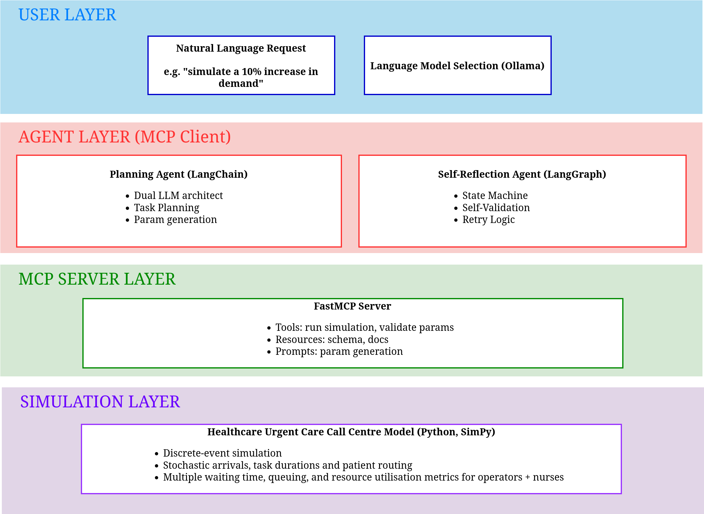
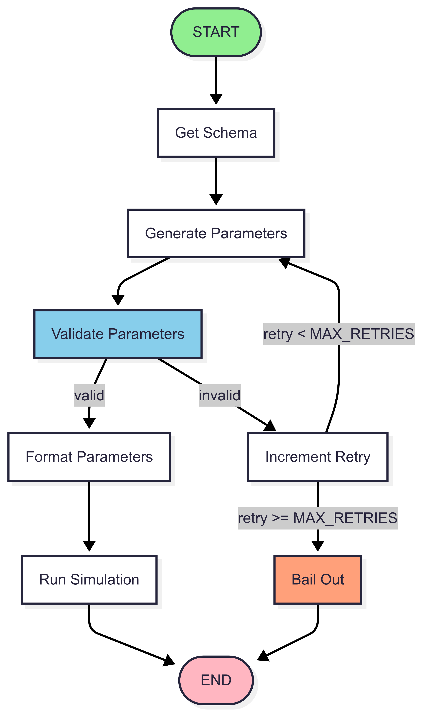

# DES Experimentation Agent

> **Advanced AI agents for discrete event simulation using self-reflection and task planning**

An intelligent agent system that demonstrates reasoning patterns for simulation experimentation through the **Model Content Protocol (MCP)**. This project showcases two agent architectures—**self-reflection** and **task planning**—applied to a healthcare call centre optimization problem.



## 🎯 Overview

This pilot project explores how AI agents can autonomously discover, configure, and experiment with discrete event simulation models. By implementing advanced reasoning patterns like **self-reflection** and **multi-step task planning**, the agents can intelligently reason about simulation parameters, learn from validation failures, and run models based on natural language interaction.

### Key Innovations

- **🧠 Self-Reflection Agent**: Uses LangGraph state machines to iteratively refine parameters through validation feedback loops
- **📋 Planning Agent**: Employs LanChain and a dual-LLM architecture for task decomposition and execution planning  
- **🔄 MCP Integration**: Uses the Model Content Protocol for standardized tool and resource access to the simulation model
- **⚡ Intelligent Parameter Generation**: Converts natural language to structured simulation parameters with validation
- **🎯 Application**: Healthcare call centre optimization with nurse callback modeling

## 🏗️ Architecture

The system consists of three main layers connected through the Model Content Protocol:

### 🤖 Agent Layer
Two complementary agent architectures demonstrate different reasoning approaches:

**Planning Agent** (`agent_planning_workflow.py`)
- **Dual LLM Architecture**: Separate models for reasoning/planning and result summarization
- **Dynamic Task Planning**: LLM generates step-by-step execution plans from available MCP capabilities
- **Memory-Driven Execution**: Maintains state between plan steps for complex workflows
- **Flexible Model Selection**: Command-line options for different LLM models and debug modes

**Self-Reflection Agent** (`agent_self_reflection.py`)  
- **LangGraph State Machine**: Graph-based workflow with conditional routing and retry logic
- **Validation-Driven Learning**: Analyzes parameter validation failures and iteratively improves
- **Bounded Retry Logic**: Intelligent bailout mechanisms prevent infinite loops
- **Failure Analysis**: Tracks validation history and provides detailed error reporting

### 🌐 MCP Layer
**FastMCP Server** (`mcp_server.py`) provides standardized access to:
- **🛠️ Tools**: Simulation execution and parameter validation
- **📚 Resources**: Schema definition for the model parameters and model documentation  
- **💬 Prompts**: LLM templates for parameter generation
- **🔍 Auto-Discovery**: Dynamic capability enumeration for agent planning

### 🏥 Simulation Layer
**Healthcare Call Centre Model** (`model.py`) - A simple discrete event simulation featuring:

#### Model Components
- **👥 Resources**: Call operators and nurses with configurable capacity
- **📞 Patient Flow**: Exponential arrival patterns with triangular service times
- **🔄 Nurse Callbacks**: 40% of patients require follow-up consultations
- **📊 Performance Metrics**: Wait times, utilization rates, and callback statistics

#### Simulation Features
- **🎲 Stochastic Modeling**: Multiple probability distributions (Exponential, Triangular, Uniform, Bernoulli)
- **🔀 Multiple Random Streams**: Reproducible results, using common random numbers
- **⏱️ Event-Driven Processing**: `SimPy` based discrete event engine
- **🎛️ Configurable Parameters**: Staff levels, demand patterns, service times, callback probabilities

#### Key Metrics
- **Mean waiting times** for operators and nurses
- **Resource utilization rates** for staff optimization
- **Callback rates** for service quality assessment
- **Patient throughput** for capacity planning

## 🚀 Getting Started

### Prerequisites

- Python 3.11+
- [Ollama](https://ollama.ai/) server running locally
- Mamba/conda or pip for environment management

### Development Environment

This project was developed and tested on the following system configuration:

**Hardware Specifications:**
- **System**: Dell XPS 8960
- **CPU**: 13th Gen Intel i9-13900K (32 cores) @ 5.900GHz
- **GPU**: NVIDIA GeForce RTX 4080
- **RAM**: 64GB
- **Operating System**: Ubuntu 24.04

**Performance Notes:**
- LLM inference with larger models (gemma3:27b, deepseek-r1:32b) benefits significantly from the high-core CPU and substantial RAM
- GPU acceleration is utilized for compatible models through Ollama
- The system handles concurrent agent execution and simulation processing efficiently

*Note: While these specifications represent the development environment, the project can run on more modest hardware configurations. Minimum requirements are Python 3.11+ and sufficient RAM for your chosen LLM models.*


### Installation

1. **Clone the repository**
   ```bash
   git clone https://github.com/pythonhealthdatascience/des_agent
   cd des-agent
   ```

2. **Create and activate environment**
   ```bash
   # Using mamba (recommended)
   mamba env create -f environment.yml
   mamba activate des-agent
   ```

   ```bash
   # Or using pip
   pip install fastmcp pandas simpy langgraph langchain langchain-ollama rich
   ```

3. **Set up Ollama models**
   ```bash
   # Install recommended models
   ollama pull gemma3:27b     # Best performance for planning and parameter generation
   ollama pull llama3:latest  # Good for summarization
   ollama pull mistral:7b     # Potentially faster alternative for self-reflection
   ```

### Quick Start

1. **Start the MCP server**
   ```bash
   python mcp_server.py
   ```
   Server will be available at `http://localhost:8001/mcp`

2. **Run the Self-Reflection Agent**
   ```bash
   python agent_self_reflection.py --llm gemma3:27b
   ```
   
   Example interaction:
   ```
   Simulation request: Simulate 14 operators, 12 nurses and 5% extra demand
   ```

3. **Run the Planning Agent**
   ```bash
   python agent_planning_workflow.py --planning gemma3:27b --summary llama3:latest
   ```

## 💡 Usage Examples

### Self-Reflection Agent
The self-reflection agent demonstrates error recovery and learning:
```bash
python agent_self_reflection.py --llm gemma3:27b
```

**Natural Language Input:**
- `"Simulate 14 operators, 12 nurses and 5% extra demand"`
- `"Run scenario with high staffing and normal call volume"`  
- `"Test configuration with minimal staff"`



**Key Features:**
- ✅ **Automatic Parameter Validation**: Catches invalid parameters and self-corrects
- 🔄 **Retry Logic**: Up to 4 attempts with validation feedback incorporation
- 📈 **Learning from Errors**: Uses validation messages to improve subsequent attempts
- 📊 **Detailed Reporting**: Shows validation history and failure analysis

### Planning Agent  
The planning agent showcases sophisticated task decomposition:

```bash
python agent_planning_workflow.py --planning gemma3:27b --summary llama3:latest --debug
```

**Workflow Demonstration:**
1. **🧠 Task Planning**: LLM analyzes available MCP capabilities and creates execution plan
2. **📋 Step Execution**: Dynamically executes each planned step (resource queries, parameter generation, validation, simulation)
3. **💾 Memory Management**: Maintains state between steps for complex workflows
4. **📊 Result Formatting**: Second LLM summarizes parameters and results in structured tables

## 🔧 Configuration

### Model Selection
Both agents support flexible LLM model configuration:

```bash
# Self-reflection agent
python agent_self_reflection.py --llm mistral:7b

# Planning agent with dual models
python agent_planning_workflow.py \
  --planning deepseek-r1:32b \
  --summary llama3.1:8b \
  --debug
```

### Simulation Parameters
The healthcare call centre model supports extensive configuration through the JSON schema:

```json
{
  "n_operators": 14,        // Call operators (1-100)
  "n_nurses": 12,           // Nurses for callbacks (1-50) 
  "mean_iat": 0.57,         // Inter-arrival time (0.1-10.0 minutes)
  "call_low": 5.0,          // Min call duration 
  "call_mode": 7.0,         // Most likely call duration
  "call_high": 10.0,        // Max call duration
  "callback_prob": 0.4,     // Nurse callback probability (0-1)
  "nurse_consult_low": 10.0, // Min nurse consultation time
  "nurse_consult_high": 20.0, // Max nurse consultation time
  "run_length": 1000,       // Simulation runtime (minutes)
  "random_seed": 42         // For reproducible results
}
```

## 🧪 Advanced Features

### Self-Reflection Capabilities
The LangGraph-based agent demonstrates sophisticated error handling:

- **🔍 Validation Analysis**: Parses structured error messages from parameter validation
- **🔄 Iterative Improvement**: Incorporates feedback into subsequent parameter generation attempts  
- **📊 History Tracking**: Maintains detailed logs of validation attempts and outcomes
- **🎯 Bounded Retry**: Intelligent bailout after maximum attempts to prevent infinite loops

### Task Planning & Reasoning
The planning agent showcases advanced reasoning about task decomposition:

- **🧠 Dynamic Planning**: Generates execution plans based on available MCP server capabilities
- **📋 Step-by-Step Execution**: Breaks complex requests into manageable subtasks
- **🔗 Dependency Management**: Ensures information dependencies are resolved in correct order
- **💾 Stateful Execution**: Maintains memory across plan steps for complex workflows

### MCP Protocol Integration
Both agents leverage the full Model Content Protocol specification:

- **🛠️ Tool Discovery**: Dynamic enumeration of available simulation and validation tools
- **📚 Resource Access**: Automatic retrieval of schemas, documentation, and configuration data
- **💬 Prompt Templates**: Server-provided LLM prompts ensure consistent parameter generation
- **🔄 Standardized Communication**: JSON-RPC messaging for reliable agent-server interaction

## 📊 Results & Outputs

### Simulation Metrics
The healthcare model provides the following performance metrics:

| Metric | Description | Use Case |
|--------|-------------|----------|
| Mean Waiting Time | Average time patients wait for operators | Service quality assessment |
| Operator Utilization | Percentage of time operators are busy | Staffing optimization |
| Nurse Waiting Time | Average wait for nurse callbacks | Callback service efficiency |
| Nurse Utilization | Percentage of nurse availability used | Nurse staffing planning |
| Callback Rate | Percentage of calls requiring nurse follow-up | Service complexity analysis |

### Agent Performance Analysis
Both agents provide detailed execution reporting:

- **📈 Self-Reflection Agent**: Validation history, retry statistics, error analysis
- **📋 Planning Agent**: Step-by-step execution logs, planning duration, memory usage
- **🎯 Success Metrics**: Parameter validation rates, simulation completion times

## 🔬 Research Applications

This project demonstrates several cutting-edge research areas:

### Agent Reasoning Patterns
- **🔄 Self-Reflection**: How agents can learn from failures and iteratively improve
- **📋 Task Planning**: LLM-driven decomposition of complex multi-step workflows
- **🧠 Meta-Reasoning**: Agents reasoning about their own reasoning processes

### Simulation Integration
- **🤖 AI-Driven Modeling**: Natural language interfaces for complex simulation configuration
- **⚡ Automated Experimentation**: Agents conducting systematic simulation studies
- **📊 Intelligent Analysis**: Automated interpretation of simulation results

### Protocol Standardization  
- **🌐 MCP Adoption**: Practical implementation of Anthropic's Model Content Protocol
- **🔧 Tool Integration**: Seamless connection of AI agents with external systems
- **📋 Capability Discovery**: Dynamic enumeration and utilization of available tools

## 🚀 Future Enhancements

### Multi-Agent Orchestration
- **👥 Agent Collaboration**: Multiple agents working together on complex experiments
- **🎯 Specialized Roles**: Planning, execution, analysis, and reporting agents
- **🔄 Workflow Coordination**: Advanced orchestration patterns for simulation campaigns

### Advanced Simulation Features
- **🏥 Multi-Model Support**: Integration with diverse simulation domains beyond healthcare
- **📊 Real-time Analytics**: Live dashboard updates during simulation execution
- **🎛️ Interactive Parameter Tuning**: Dynamic adjustment of simulation parameters

### Enhanced Reasoning
- **🧠 Causal Reasoning**: Understanding cause-and-effect relationships in simulation results
- **📈 Optimization Integration**: Automatic parameter optimization using simulation feedback
- **🎯 Goal-Oriented Planning**: Agents working backwards from desired outcomes

## 🔧 Troubleshooting

### Common Issues

**MCP Server Connection Failed**
- Ensure the MCP server is running on `http://localhost:8001/mcp`
- Check that no other processes are using port 8001
- Verify FastMCP installation: `pip install fastmcp`

**Ollama Model Not Found**
- Confirm model installation: `ollama list`
- Pull missing models: `ollama pull gemma3:27b`
- Check Ollama server status: `ollama serve`

**Parameter Validation Failures**
- Review the schema.json file for parameter constraints
- Ensure numeric values are within specified ranges
- Verify all required parameters are provided

**Agent Timeout or Performance Issues**
- Try smaller LLM models (e.g., `llama3:latest` instead of `gemma3:27b`)
- Increase retry limits in agent configuration
- Monitor system resources during execution

For additional support, please open an issue with detailed error logs and system information.

## 🤝 Contributing

This project welcomes contributions in several areas:

- **🔬 New Agent Architectures**: Alternative reasoning patterns and workflow designs
- **🏥 Simulation Models**: Additional domains and model types
- **🛠️ MCP Extensions**: New tools, resources, and capabilities
- **📊 Analysis Features**: Enhanced result interpretation and visualization

<!-- ## 📚 References & Related Work

This project builds upon and demonstrates several key research areas:

- **Model Content Protocol**: [Anthropic's MCP Specification](https://modelcontextprotocol.io/)
- **LangGraph**: [Agent Workflow Orchestration](https://langchain-ai.github.io/langgraph/)
- **SimPy**: [Discrete Event Simulation in Python](https://simpy.readthedocs.io/)
- **Self-Reflection in AI**: [Reflexion Framework](https://arxiv.org/abs/2303.11366)
- **Agent Planning**: [Task Decomposition and Planning](https://research.csiro.au/ss/science/projects/agent-design-pattern-catalogue/) -->

## 📜 License

This project is released under the MIT License. See `LICENSE` file for details.

---

**Built for the future of intelligent simulation** 🚀

*This project demonstrates advanced AI agent capabilities for simulation experimentation, showcasing self-reflection, task planning, and protocol standardization through practical healthcare optimization applications.*
